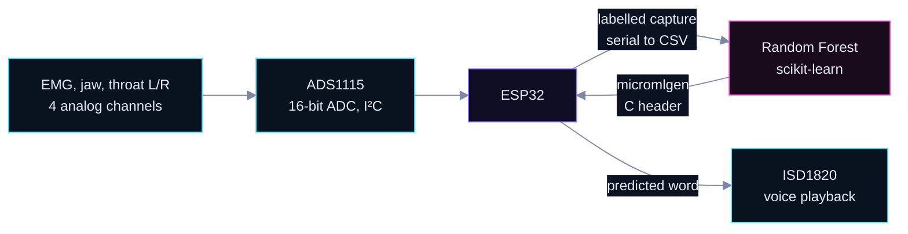
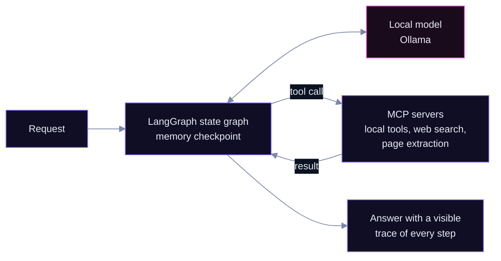
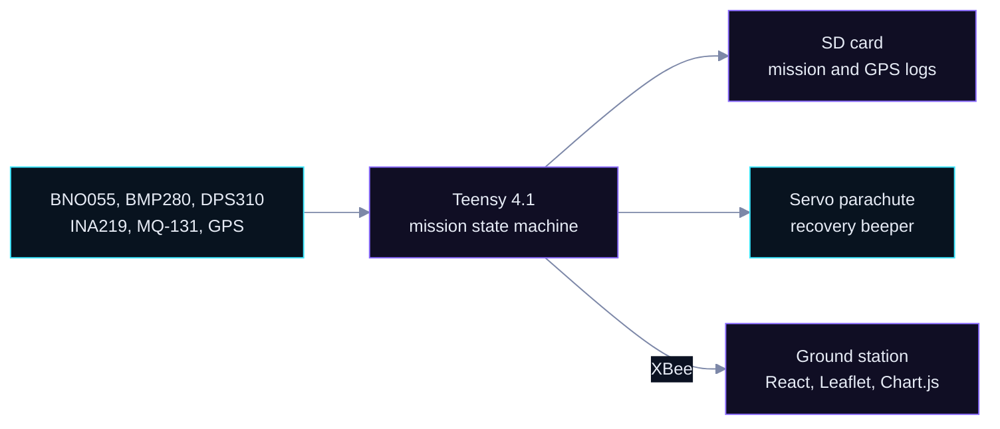
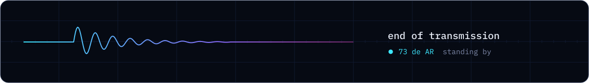

<!--
  Profile README for github.com/AntoRoshanm

  Maintaining this page
  - Visuals: edit tokens in scripts/build_assets.py, then `python scripts/build_assets.py`
  - "Recently shipped": updated weekly by .github/workflows/refresh-log.yml (do not edit by hand)
  - Colour meaning is fixed: signal = hardware/RF/firmware, system = software, intelligence = models/agents
-->

  

  <b>Software Developer Consultant</b> &nbsp;/&nbsp; Electronics &amp; Communication Engineer

  I build systems that sense the physical world, move its data, and reason about it: 
  sensor firmware, RF simulation, telemetry software, on-device ML and local LLM agents.

  &nbsp;
  &nbsp;
  

  
    <a href="#selected-work">Work</a> &nbsp;/&nbsp;
    <a href="#lab-notes">Lab notes</a> &nbsp;/&nbsp;
    <a href="#hardware-and-rf">Hardware and RF</a> &nbsp;/&nbsp;
    <a href="#toolchain">Toolchain</a> &nbsp;/&nbsp;
    <a href="#recently-shipped">Recently shipped</a>
  

## What I build

My work runs along one chain. Each layer has a colour, and it means the same thing everywhere on this page.

| Layer | Work | Where to see it |
|:--|:--|:--|
|  | Firmware for ESP32, ESP8266, Teensy 4.1 and Arduino. Sensor front-ends over I²C and serial. Links over XBee, MQTT, Wi-Fi and GSM. Antenna modelling in Ansys HFSS. | [CanSat 2025](https://github.com/AntoRoshanm/CanSat-2025), [silent-speech wearable](https://github.com/AntoRoshanm/Wearable-Silent-Speech-Recognition-Device-for-Non-Verbal-Communication-), [smart streetlight](https://github.com/AntoRoshanm/IoT-Enabled-Smart-Streetlight-with-Adaptive-Brightness), [metasurface study](https://github.com/AntoRoshanm/Holographic-Metasurface-Design-Analysis-and-Simulation) |
|  | Software that moves and presents data. React and TypeScript dashboards, React Native apps, FastAPI, Flask and Express services, Firebase and MongoDB. | [CanSat ground station](https://github.com/AntoRoshanm/CanSat-2025), [Agent UI](https://github.com/AntoRoshanm/Ai_Agent), [ChatWorld](https://github.com/AntoRoshanm/ChatWorld) |
|  | Models and agents that act on the data. LangGraph and MCP agents on local models, tree ensembles compiled for microcontrollers, embedding-based computer vision. | [Ai_Agent](https://github.com/AntoRoshanm/Ai_Agent), [terminal agent](https://github.com/AntoRoshanm/terminal_ai_agent), [wearable](https://github.com/AntoRoshanm/Wearable-Silent-Speech-Recognition-Device-for-Non-Verbal-Communication-), [ArcFace](https://github.com/AntoRoshanm/Arcface_face_recognition) |

## Selected work

### [CanSat 2025: flight computer and ground station](https://github.com/AntoRoshanm/CanSat-2025)

 &nbsp; competition build for the IN-SPACe CanSat India Student Competition 2024–25, Dr.MGR-ACS SAT team

Mission firmware that reads six sensors, tracks altitude on two barometers, and runs an autonomous state machine that deploys the parachute and starts a recovery beacon, with a React and TypeScript ground-station interface alongside it.

<b>Engineering breakdown</b>

 

**Problem.** A CanSat has to log science data, stream telemetry and recover itself with nobody in the loop.

**Approach.** A Teensy 4.1 reads a BNO055 (orientation), BMP280 and DPS310 (dual barometric altitude), INA219 (power), MQ-131 (ozone) and a NavIC GPS. Altitude and motion drive the mission states below; a servo releases the parachute and a buzzer marks the landing site. Every sample is written to SD as RTC-timestamped mission and GPS logs, and transmitted over XBee.

**Ground station.** React, TypeScript and Vite, with a Leaflet map, Chart.js telemetry plots, gauges, battery and parachute status. The current build replays generated packets, so the interface can be demonstrated without hardware.

**Stack.** C++ (Arduino framework), Teensy 4.1, XBee, TypeScript, React, Vite, Tailwind, Leaflet, Chart.js

### Local-first AI agents: [Ai_Agent](https://github.com/AntoRoshanm/Ai_Agent) and [terminal_ai_agent](https://github.com/AntoRoshanm/terminal_ai_agent)

 &nbsp; in development, runs on local models with no API key

Two agents built to act rather than describe: a LangGraph agent that calls tools through MCP servers against a local Ollama model, and a Windows terminal agent that runs real system tools, checks the outcome, and only then reports back.

<b>Engineering breakdown</b>

 

**Problem.** Most assistants tell you which command to run instead of running it, and depend on a cloud API.

**Ai_Agent.** A LangGraph state graph with memory checkpointing. Tools are exposed through MCP (`langchain-mcp-adapters`): a local tools server, web search and page extraction. Inference runs through `ChatOllama`. A FastAPI and Uvicorn backend sits behind a Flask interface that shows each reasoning step and tool call as it happens.

**terminal_ai_agent.** A tool-first rule: any question about the machine (processes, ports, files, installed software) is answered by executing a real tool and verifying the result, never by generic instructions. Local Qwen through Ollama by default; OpenAI, Anthropic or Gemini as optional providers. Pydantic settings, a Rich and prompt_toolkit terminal UI, and a pytest suite.

**Stack.** Python, LangGraph, LangChain Core, MCP, Ollama, Qwen, FastAPI, Uvicorn, Flask, Pydantic, pytest

### [Silent-speech wearable](https://github.com/AntoRoshanm/Wearable-Silent-Speech-Recognition-Device-for-Non-Verbal-Communication-)

 &nbsp; prototype, inference runs on the ESP32

A wearable for non-verbal communication. It reads muscle and throat activity, classifies it on the microcontroller itself, and plays the recognised word aloud. The full pipeline is drawn in [Lab notes](#lab-notes).

<b>Engineering breakdown</b>

 

**Problem.** Someone who cannot vocalise still produces measurable muscle and throat activity when attempting a word.

**Approach.** Four analog channels (EMG, jaw, left and right throat) are digitised by an ADS1115 16-bit ADC over I²C. A capture sketch and `serial_monitoring.py` record labelled samples to CSV. `train_model.py` fits a Random Forest (10 trees, depth up to 10) in scikit-learn, and micromlgen ports it to a C header so inference runs on the ESP32 with no network. A recognised word triggers an ISD1820 module to play the recorded voice.

**Result.** A working end-to-end prototype. The current model is trained on a single target word ("Yes").

**Stack.** ESP32, ADS1115, C++, Python, pandas, scikit-learn, micromlgen

### [Holographic metasurface study](https://github.com/AntoRoshanm/Holographic-Metasurface-Design-Analysis-and-Simulation)

&nbsp; simulation study in Ansys HFSS

An HFSS model of a 5 mm spiral radiating element: a first step into metasurface unit cells for holographic antenna design.

### More builds

| Project | What it does | Built with |
|:--|:--|:--|
| [ArcFace face recognition](https://github.com/AntoRoshanm/Arcface_face_recognition) | Face embeddings matched by cosine similarity | PyTorch, OpenCV, scikit-learn |
| [Virtual try-on](https://github.com/AntoRoshanm/vr_tryon) | Pose and face-mesh landmarks with VGG16 feature similarity | TensorFlow, MediaPipe, OpenCV, Flask |
| [Heart-rate monitor](https://github.com/AntoRoshanm/DEVELOPING-A-PORTABLE-ECG-MONITRING-SYSTEN-USING-AN-ESP32) | MAX3010x optical sensing streamed to the cloud | ESP32, Firebase |
| [Smart streetlight](https://github.com/AntoRoshanm/IoT-Enabled-Smart-Streetlight-with-Adaptive-Brightness) | Adaptive brightness from light and motion, reported over MQTT | ESP8266, MQTT |
| [Predictive maintenance](https://github.com/AntoRoshanm/PREDICTIVE-MAINTENANCE-SYSTEM-FOR-INDUSTRIAL-EQUIPMENTS) | Failure prediction on industrial sensor data | XGBoost, scikit-learn, pandas |
| [MARTAHO 5G routing](https://github.com/AntoRoshanm/MARTAHO-Multi-Layer-Adaptive-Routing-with-TSP-ACO-Hybrid-Optimization-in-5G-Networks) | TSP and ant-colony hybrid routing study with ML evaluation | TensorFlow, XGBoost, SciPy |

Nine more

 

| Project | What it does | Built with |
|:--|:--|:--|
| [Face recognition web app](https://github.com/AntoRoshanm/face-recognition) | Live Haar-cascade detection with a KNN classifier | Flask, OpenCV, scikit-learn |
| [Neural style transfer](https://github.com/AntoRoshanm/Neural-Style-Transfer-Using-Pre-trained-VGG19-Network) | Style transfer on VGG19 feature maps | PyTorch, torchvision |
| [Food-spoilage monitor](https://github.com/AntoRoshanm/Iot-based-food-spoilage-detection-using-node-mcu) | Storage temperature and humidity tracking | NodeMCU, DHT11, Firebase |
| [GPS tracker](https://github.com/AntoRoshanm/SMART-GPS-TRACKER-USING-ARDUINO) | Location reporting over a GSM module | Arduino, TinyGPS |
| [Density-based traffic lights](https://github.com/AntoRoshanm/TWO-WAY-DENSITY-BASED-TRAFFIC-LIGHT-SYSTEM) | Signal timing driven by lane density | Arduino |
| [Billing software](https://github.com/AntoRoshanm/Billing-software) | Desktop billing with barcode generation and cloud sync | Python, Tkinter, SQLite, Firebase |
| [ExamWebsite](https://github.com/AntoRoshanm/ExamWebsite) | Exam management with charted results | React, Express, MongoDB, Firebase |
| [ChatWorld](https://github.com/AntoRoshanm/ChatWorld) | Mobile chat with auth, realtime database and storage | React Native, Firebase |
| [MusicPro](https://github.com/AntoRoshanm/MusicPro) | Mobile music player | React Native, Firebase |

## Lab notes

Two pipelines from the repositories above, drawn the way the code actually runs.

**Train off-device, infer on-device.** The silent-speech wearable: data is captured over serial, the model is trained in Python, and the trained model is compiled back into firmware.

**An agent that acts.** Ai_Agent's loop: the graph keeps state, the local model decides, and MCP servers do the work.

**Embeddings.** The ArcFace and virtual try-on projects both reduce images to feature vectors and match them by cosine similarity. It is the same primitive that sits under semantic search and retrieval, and the one I am now applying to documents.

## Hardware and RF

Software is half of the work. The other half is getting clean data out of the physical world, which is where an ECE background earns its keep.

- **Antennas.** Metasurface element modelled in [Ansys HFSS](https://github.com/AntoRoshanm/Holographic-Metasurface-Design-Analysis-and-Simulation).
- **Links.** XBee telemetry on the CanSat, MQTT on the [streetlight](https://github.com/AntoRoshanm/IoT-Enabled-Smart-Streetlight-with-Adaptive-Brightness), GSM on the [GPS tracker](https://github.com/AntoRoshanm/SMART-GPS-TRACKER-USING-ARDUINO), Wi-Fi to Firebase on the [heart-rate](https://github.com/AntoRoshanm/DEVELOPING-A-PORTABLE-ECG-MONITRING-SYSTEN-USING-AN-ESP32) and [food-storage](https://github.com/AntoRoshanm/Iot-based-food-spoilage-detection-using-node-mcu) monitors.
- **Networks.** A 5G routing optimisation study, [MARTAHO](https://github.com/AntoRoshanm/MARTAHO-Multi-Layer-Adaptive-Routing-with-TSP-ACO-Hybrid-Optimization-in-5G-Networks).
- **Background.** B.E. Electronics and Communication Engineering, Dr. M.G.R. Educational and Research Institute, 2021–2025.

## Toolchain

Only what appears in the repositories above.

| Area | Tools |
|:--|:--|
| Languages | Python, C and C++, TypeScript, JavaScript |
| Embedded and IoT | ESP32, ESP8266 (NodeMCU), Teensy 4.1, Arduino, ADS1115, XBee, MQTT, Firebase |
| ML and vision | PyTorch, TensorFlow, scikit-learn, XGBoost, OpenCV, MediaPipe, micromlgen |
| Agents and LLMs | LangGraph, MCP, Ollama, Qwen, FastAPI |
| Web and mobile | React, React Native, Vite, Tailwind, Leaflet, Chart.js, Flask, Express, MongoDB |
| RF and simulation | Ansys HFSS |

## Currently

- **Building** local-first agents: LangGraph and MCP on models that run on my own machine.
- **Exploring** local retrieval (embeddings and vector search) to ground those agents in documents, and small language models with NPU-accelerated inference for edge hardware.
- **Interested in** putting inference next to the sensor, the way the wearable does, at larger scale.

## Recently shipped

<!-- LOG:START -->
| Updated | Repository | Language | About |
|---|---|---|---|
| `2026-08-23` | [terminal ai agent](https://github.com/AntoRoshanm/terminal_ai_agent) | Python | Offline-first Windows agent: local Qwen via Ollama, runs real system tools and verifies results |
| `2026-08-09` | [Ai Agent](https://github.com/AntoRoshanm/Ai_Agent) | JavaScript | LangGraph agent with MCP tool servers and a local Ollama model; UI shows every reasoning and tool step |
| `2025-11-15` | [CanSat 2025](https://github.com/AntoRoshanm/CanSat-2025) | TypeScript | Main Arduino firmware for the IN-SPACe CanSat India 2024–25 project — handling sensor integration, data… |
| `2025-05-30` | [Billing software](https://github.com/AntoRoshanm/Billing-software) | Python | Desktop billing app: Tkinter/ttkbootstrap, SQLite with Firebase sync, barcode generation |
| `2025-05-12` | [Wearable Silent Speech Recognition Device for Non Verbal Communication](https://github.com/AntoRoshanm/Wearable-Silent-Speech-Recognition-Device-for-Non-Verbal-Communication-) | C++ | ESP32 wearable: 4-channel EMG/throat sensing, on-device Random Forest, voice playback |
<!-- LOG:END -->

Refreshed weekly from the GitHub API by a workflow in this repository.

  &nbsp;
  &nbsp;
  

  

<i>Blending electronics with intelligence, building the future one signal at a time.</i>

